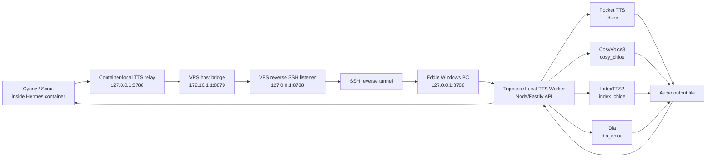

# Trippcore Local TTS Bridge System Overview

Date: 2026-06-22

Audience: junior engineer learning how the Trippcore local TTS bridge works end to end.

## Big Picture

The Trippcore Local TTS Worker runs on Eddie's Windows PC because the GPU, voice files, model files, and local runtimes live there. Cyony/Scout runs on the cloud side, inside a Hostinger/Docker/Hermes environment.

The cloud cannot directly call Eddie's PC. That is intentional.

Instead, the system uses a private reverse bridge:

1. Eddie's PC starts a local-only TTS API.
2. Eddie's PC opens a reverse SSH tunnel to the VPS.
3. The VPS exposes that reverse tunnel only to local/private processes.
4. A small VPS host relay makes the tunnel reachable from Docker.
5. A small container relay makes the worker appear local to Cyony.
6. Cyony calls `http://127.0.0.1:8788` from inside her container.
7. That request travels back through the bridge to Eddie's PC.
8. The Windows worker runs a TTS provider and returns an audio URL.

This gives the cloud agent access to local GPU/model capability without making Eddie's PC publicly reachable.

## End-To-End Diagram



## Main Components

### 1. Windows TTS Worker

Root:

```text
D:\Trippcore\services\tripp-tts-worker
```

Local API:

```text
http://127.0.0.1:8788
```

Important endpoints:

```text
GET  /health
POST /v1/tts
GET  /v1/audio/:filename
```

The worker is a Node service. It does not synthesize speech directly. Its job is to:

- load config from the local environment,
- validate requests,
- authenticate protected endpoints,
- resolve a voice alias to a provider,
- call the correct Python/provider runtime,
- save the generated audio,
- optionally transcode to MP3,
- return a URL for the generated audio,
- serve the generated file back through `/v1/audio/...`.

The worker should stay bound to:

```text
127.0.0.1
```

That means only local processes on Eddie's PC can call it directly. Cloud access must come through the private bridge.

### 2. Worker Configuration

The worker uses an env file under the worker root. The important secret is:

```text
TRIPP_TTS_SHARED_SECRET
```

Do not print it, paste it into chat, log it, or commit it.

The cloud side must have the same shared secret in its own secure env file. Requests to `/v1/tts` and `/v1/audio/...` use:

```text
Authorization: Bearer <shared secret>
```

`/health` is intentionally lightweight and can be unauthenticated while the worker is bound only to localhost.

### 3. Voice Aliases

The worker exposes voice aliases. A cloud caller should use aliases, not local model paths.

Current intended aliases:

| Alias | Provider | Purpose |
|---|---|---|
| `chloe` | Pocket TTS | Primary production clone voice. |
| `cosy_chloe` | CosyVoice3 | Clone-preserving voice with direct mood/instruction control. |
| `index_chloe` | IndexTTS2 | Clone-preserving voice with emotion text/vector support. |
| `dia_chloe` | Dia | Experimental emotional/dialogue model. |

Previously used alias:

| Alias | Status |
|---|---|
| `qwen_chloe` | Disabled to free VRAM for Dia. |

The cloud helper layer currently keeps `qwen` and `qwen_chloe` as compatibility aliases, but those route to `index_chloe` instead of calling a disabled worker voice.

## Request Lifecycle

### Step 1: Cyony Requests Speech

Cyony or a helper script creates a JSON request:

```json
{
  "text": "Hey, this is a test.",
  "voice": "cosy_chloe",
  "style": "calm",
  "return_format": "mp3",
  "return_audio_base64": false
}
```

For instruction-capable voices, callers can send:

```json
{
  "text": "Hey, come here for a second.",
  "voice": "index_chloe",
  "instruct": "whisper softly, intimate, breathy, close microphone delivery",
  "return_format": "mp3",
  "return_audio_base64": false
}
```

Supported style presets:

```text
whisper
annoyed
excited
intimate
calm
urgent
soft
loud
fast
slow
happy
angry
```

Not every provider obeys style/instruction the same way.

### Step 2: Container Relay

Inside the Hermes/Cyony Docker container, Cyony calls:

```text
http://127.0.0.1:8788
```

This looks like a local API from Cyony's point of view, but it is not the real Windows worker. It is a container-local relay process.

That relay forwards traffic out of the container to the VPS host bridge.

### Step 3: VPS Host Bridge

The VPS host bridge listens on:

```text
172.16.1.1:8879
```

It forwards container-originated traffic to:

```text
127.0.0.1:8788
```

on the VPS host.

This exists because Docker containers cannot always reach host-only loopback services directly. The bridge gives the container a private route to the host.

### Step 4: Reverse SSH Tunnel

On the VPS host, `127.0.0.1:8788` is an SSH reverse tunnel listener.

The tunnel is created from Eddie's PC with a command shaped like:

```text
ssh -N -R 127.0.0.1:8788:127.0.0.1:8788 root@<vps>
```

Meaning:

```text
VPS 127.0.0.1:8788 -> Eddie PC 127.0.0.1:8788
```

Important security detail:

The remote listener is bound to:

```text
127.0.0.1
```

not:

```text
0.0.0.0
```

That means the TTS worker is not exposed publicly on the VPS network interface.

### Step 5: Windows Worker Receives Request

The request arrives at Eddie's PC:

```text
http://127.0.0.1:8788/v1/tts
```

The worker:

1. validates JSON,
2. verifies bearer auth,
3. checks text length and voice alias,
4. maps the alias to a provider,
5. builds a provider-specific command,
6. launches the provider runtime,
7. waits for the audio output,
8. returns metadata and an audio URL.

### Step 6: Provider Runtime Generates Audio

Each provider has a separate model/runtime path.

#### Pocket TTS

Alias:

```text
chloe
```

Role:

- primary production voice,
- clone-preserving,
- no real direct mood control.

The worker calls Pocket through `uvx pocket-tts`.

Strength:

- fast and production-oriented.

Weakness:

- if the Python/uvx environment gets polluted, it can import the wrong packages.

#### CosyVoice3

Alias:

```text
cosy_chloe
```

Role:

- clone-preserving,
- supports instruction/mood control.

Runtime:

```text
D:\Trippcore\runtimes\cosyvoice3
```

Strength:

- currently working,
- good fallback for expressive/mood TTS.

#### IndexTTS2

Alias:

```text
index_chloe
```

Role:

- clone-preserving,
- direct emotion support through emotion text or vector.

Runtime:

```text
D:\Trippcore\repos\index-tts\.venv
```

Model:

```text
D:\Trippcore\models\indextts\IndexTTS-2
```

Strength:

- promising emotion-capable clone voice.

Weakness:

- currently loads per request,
- slower than Pocket,
- sensitive to Python dependency versions.

#### Dia

Alias:

```text
dia_chloe
```

Role:

- experimental emotional/dialogue TTS,
- supports tags like `(laughs)`, `(sighs)`, `(gasps)`.

Runtime:

```text
D:\Trippcore\runtimes\dia
```

Model:

```text
D:\Trippcore\models\dia\Dia-1.6B-0626
```

Strength:

- potentially expressive dialogue.

Weakness:

- model layout currently needs repair,
- VRAM pressure can be high.

### Step 7: Worker Returns Audio Metadata

Successful response shape:

```json
{
  "ok": true,
  "job_id": "tts_YYYYMMDD_HHMMSS_abcdef",
  "voice": "cosy_chloe",
  "audio_url": "/v1/audio/tts_YYYYMMDD_HHMMSS_abcdef.mp3"
}
```

The cloud caller then fetches:

```text
GET /v1/audio/tts_YYYYMMDD_HHMMSS_abcdef.mp3
```

with the same bearer auth header.

That audio file travels back through the same bridge path in reverse.

## Why `/health` Can Be Green While TTS Is Broken

`/health` checks that the worker is up and that configured paths/aliases exist.

It does not necessarily prove:

- the Python provider can import all packages,
- the model can load,
- CUDA can allocate memory,
- the exact model files are present,
- the provider can generate audio,
- MP3 conversion works.

So there are two levels of health:

| Health type | What it proves |
|---|---|
| API health | Worker process and config are visible. |
| Provider generation health | A real voice can generate and return audio. |

In this incident, API health was green but provider generation health was broken for most providers.

## Recommended Monitoring Model

Use a layered check.

### Layer 1: Worker Reachability

From Windows:

```text
GET http://127.0.0.1:8788/health
```

From VPS host:

```text
GET http://127.0.0.1:8788/health
```

From VPS host bridge:

```text
GET http://172.16.1.1:8879/health
```

From container:

```text
GET http://127.0.0.1:8788/health
```

### Layer 2: Authenticated TTS Smoke

For each provider, do a short authenticated generation request.

Minimum set:

```text
chloe
cosy_chloe
index_chloe
dia_chloe
```

The test only passes if:

- `/v1/tts` returns success,
- an `audio_url` is returned,
- `/v1/audio/...` can fetch the audio,
- the output file is non-empty.

### Layer 3: Provider Import Checks

Each provider should have a cheap import/model-file check.

Examples:

- Pocket can import `pocket_tts`.
- Cosy runtime imports its model modules.
- Index runtime imports `indextts`.
- Dia runtime can see expected weight files.

These checks should avoid generating long clips.

## Common Failure Modes

### Tunnel Down

Symptoms:

- Hostinger cannot reach `http://127.0.0.1:8788/health`.
- Container cannot reach `http://127.0.0.1:8788/health`.
- Errors look like connection refused or timeout.

Fix:

- Restart reverse SSH tunnel from Eddie's PC.
- Confirm the remote listener is bound to `127.0.0.1`.

### Container Relay Down

Symptoms:

- VPS host can reach health.
- Container cannot reach health.

Fix:

- Restart the container-local relay.
- Confirm it forwards to `172.16.1.1:8879`.

### Host Bridge Down

Symptoms:

- VPS `127.0.0.1:8788` works.
- `172.16.1.1:8879` fails.
- Container relay fails because it has nowhere to forward.

Fix:

- Restart VPS host bridge relay.

### Auth Broken

Symptoms:

- `/health` works.
- `/v1/tts` or `/v1/audio/...` returns unauthorized.

Fix:

- Confirm cloud env file has the right secret.
- Do not print or paste the secret.
- Confirm the helper sends `Authorization: Bearer ...`.

### Provider Runtime Broken

Symptoms:

- `/health` works.
- `/v1/tts` returns 500.
- Logs mention Python imports, missing modules, CUDA, model files, or dependency versions.

Fix:

- Inspect provider-specific logs.
- Repair the provider venv or model directory.
- Re-run generation smoke.

## Security Model

The system has several intentional boundaries:

1. The Windows worker binds only to localhost.
2. The VPS reverse tunnel binds only to VPS localhost.
3. Docker reaches the VPS host through a private bridge IP.
4. `/v1/tts` and `/v1/audio/...` require bearer auth.
5. Cloud callers use voice aliases, not arbitrary local paths.
6. The worker should not accept shell commands or local filesystem paths from cloud callers.

This design prevents the TTS worker from becoming a public internet API.

## Operational Rules For Engineers

Do:

- Use `/health` to check bridge reachability.
- Use short authenticated smoke tests to check real generation.
- Keep provider runtimes isolated.
- Keep model files in expected local directories.
- Use voice aliases only.
- Redact secrets in logs and reports.

Do not:

- Expose port `8788` publicly.
- Bind the Windows worker to `0.0.0.0`.
- Paste the shared secret into chat.
- Put the shared secret in docs or commits.
- Let cloud callers choose arbitrary local paths.
- Assume `/health` means every provider can generate.

## Current Mental Model

Think of the system as four nested shells:

1. Cyony's local view: `127.0.0.1:8788` inside the container.
2. VPS private routing: container relay plus host bridge.
3. SSH reverse tunnel: VPS localhost back to Eddie's PC.
4. Windows worker: actual TTS model execution.

When debugging, always identify which shell is broken.

Fast triage:

| Question | If yes | If no |
|---|---|---|
| Does Windows `/health` work? | Worker process is up. | Fix local worker first. |
| Does VPS localhost `/health` work? | Tunnel is up. | Fix reverse SSH tunnel. |
| Does VPS host bridge `/health` work? | Host bridge is up. | Fix bridge relay. |
| Does container `/health` work? | Container relay is up. | Fix container relay. |
| Does `/v1/tts` generate? | Provider works. | Fix provider runtime/model. |

## Suggested Future Improvements

### Persistent Provider Servers

IndexTTS2 currently loads per request, making it slow. If it becomes a keeper, run it as a persistent local daemon so the model stays warm.

### Provider Readiness Endpoint

Add:

```text
GET /health/providers
```

This should report:

- configured,
- importable,
- model files present,
- last generation smoke result,
- last error summary.

### Cloud Helper Self-Test

Add a cloud helper command:

```text
/opt/data/tripp-tts-smoke-all.sh
```

It should check:

- health,
- auth,
- one tiny generation per enabled voice,
- audio fetch.

### Cleaner Runtime Isolation

Every provider subprocess should launch with a sanitized Python environment so one venv cannot poison another.

This is especially important because the cloud/agent tooling and local model tooling both use Python.

## Safe Default Voice Guidance

Current practical guidance:

- Use `cosy_chloe` for expressive generation while repairs are underway.
- Use `chloe` only after Pocket is repaired.
- Use `index_chloe` after dependency pinning is fixed.
- Use `dia_chloe` after the Dia model file layout is fixed.
- Do not use `qwen_chloe` unless Qwen is intentionally re-enabled.

## Content Safety Boundary

Use only voices Eddie owns or has permission to use.

Do not use the system for:

- minors,
- non-consensual impersonation,
- public-figure deception,
- fraud,
- harassment,
- illegal content.

